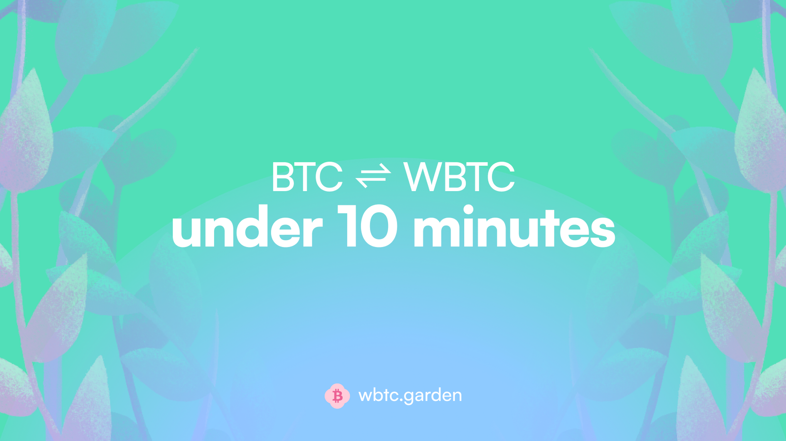
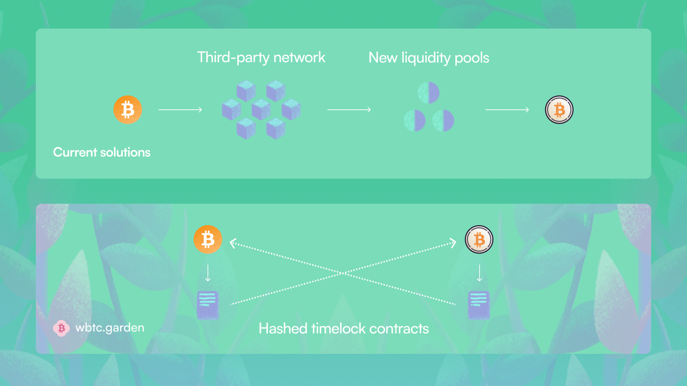

# Introduction To Garden

*TLDR; Garden is the fastest way to bridge BTC to WBTC and vice-versa, providing a 10x improvement over existing options. It is decentralized, trustless, audited, and not a real garden. Find us on [𝕏](https://twitter.com/wbtcgarden?ref=wbtc-garden.ghost.io) to grab access codes for the app.*

Welcome to Garden! Your choice of bridging for blazing quick BTC to WBTC swaps. We currently support Ethereum, Arbitrum and are capable of supporting any L1/L2. Garden is the first implementation of [Catalog](http://catalog.fi), a cross-chain protocol with a mission to enable seamless and secure Bitcoin support to any dApp.

We built Garden to address the need for a quick and native bridging solution tailored to Bitcoin.

**Time = Opportunity Cost**

DeFi operates at break-neck speeds. Things can change in a matter of seconds. For a [keeper](https://rzurrer.medium.com/keepers-workers-that-maintain-blockchain-networks-a40182615b66), the arbitrage or liquidation opportunity is short-lived before someone picks it up. The same goes for a trader who finds a farming opportunity, an ICO, or an anomaly in the system. Every second counts and you have to mobilise liquidity ASAP, in that sense, it is truly the survival of the quickest.

That's where Bitcoin holders suffer more than any other community. Their participation in DeFi is severely impaired by the amount of time it takes to bridge BTC to WBTC, which is by far still the most supported and liquid asset.

Most of the existing solutions are built on custodian networks, AMM liquidity pools, or a combination of both. As a result, swap durations fluctuate vastly, ranging from 2 minutes to ~24 hours contingent on the amount being converted and the time taken by custodian networks for wrapping/unwrapping (tends to be between 3-5 hours). While some solutions offer “time-optimized” choices, they can result in extreme slippage (ranging from 4-40% for a 1-20 BTC trade).

> ***Garden removes the need for any wrapping/unwrapping or AMMs by utilising Catalog's P2P cross-chain order book and typically requires less than 3 minutes to find an order match, deferring the primary***

Our current average trade times:

- **BTC → WBTC: Under 10 minutes**
- **WBTC → BTC: Under 5 minutes**
<!-- https://garden.finance/blogs/market-making-and-staking/

https://garden.finance/blogs/wbtc-garden-introducing-seed/ -->
