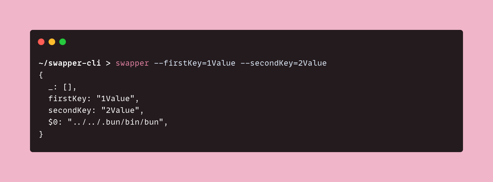
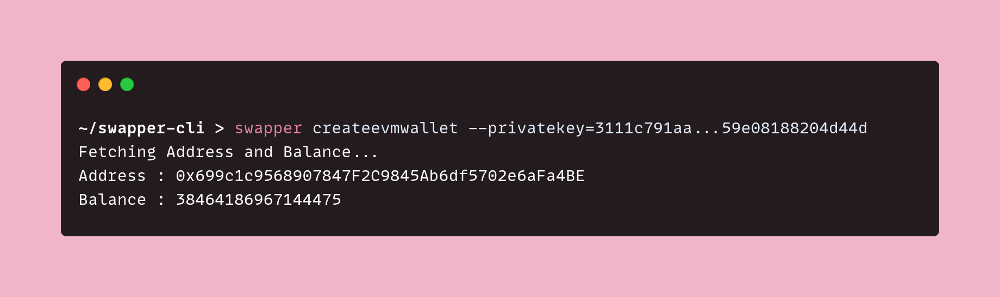
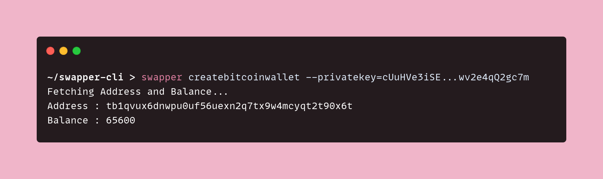
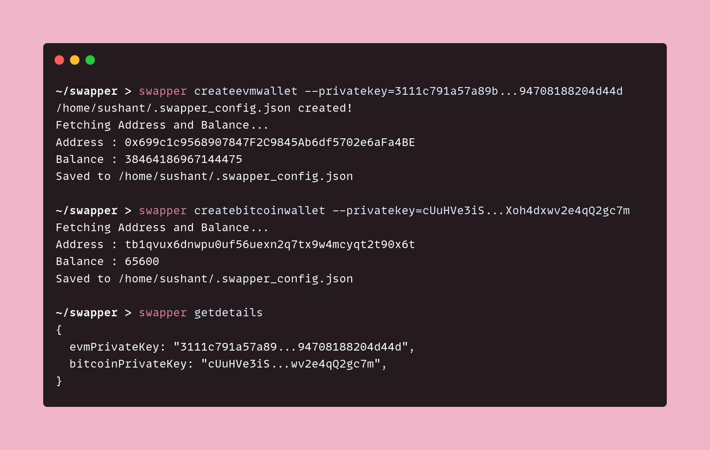
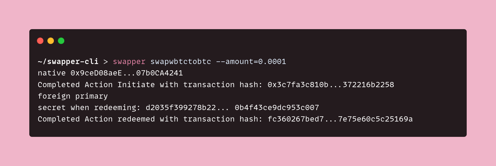

# CLI tool with Garden SDK

:::note
This guide is provided as an example to help you get accustomed to using the Garden SDK. It is not intended to serve as a standard for creating CLI tools with the Garden SDK. A proper tool will take into consideration many best practices and optimizations. In the example below, we have cut a lot of corners for simplicity. Full code is available here [Swapper CLI](https://github.com/gardenfi/swapper-cli).
:::

# Introduction

This guide will walk you through building your own command-line interface (CLI) to manage your crypto assets using the **Garden SDK**, by the end of this guide you should be able to

- Create wallets (both Bitcoin and EVM)
- Swap **WBTC** and **BTC** (or vice versa)
  all using the CLI.

# Prerequisites

You should have [Bun](https://bun.sh/), but you can use Nodejs too.

```console
# Linux and macOS
curl -fsSL https://bun.sh/install | bash

# Windows
powershell -c "irm bun.sh/install.ps1 | iex"
```

# Setting up your environment

```shell
mkdir swapper-cli
cd swapper-cli
bun init -y
```

# File Structure

- Create a src folder
- Move `index.ts` to src
- Create `command.ts` , `errors.ts` , `types.ts` , `utility.ts` in **src**

# Registering the CLI

- **Defining the CLI's entry point**

In your `package.json` file, add the following

```js
"bin": {
    "swapper": "./src/index.ts"
}
```

This entry specifies that when you run the `swapper` command, the `src / index.ts` file should be executed.

- **Configuring the CLI's entry File**
  Add **#!/usr/bin/env bun** to `index.ts`, after which your `index.ts` file should look something like this:

```shell
#! /usr/bin/env bun

console.log("Hello via Bun!");
```

- **Bun link**

```
bun link
bun link < mentioned in the output of bun link >
```

# Installing Packages

```shell
# Installs Garden SDK
bun add @catalogfi/wallets @gardenfi/orderbook @gardenfi/core

# Installs Yargs an npm package used for building cli tools
bun add yargs

# Intalling the types for Yargs
bun add -D @types/yargs

# Installs ethers 6.8.0 as other versions may not be compatible with the SDK
bun add ethers@6.8.0
```

# Basic Setup

- **Initiating yargs**
  Yargs in an npm package widely used for building CLI's with nodejs.

```ts
// File: src/command.ts

import yargs from "yargs";
import { hideBin } from "yargs/helpers";

import { type Argv } from "./types.ts";

const ivar = yargs(hideBin(process.argv)).argv as Argv;
let ccreator = yargs(hideBin(process.argv));

export { ivar, ccreator };
```

```ts
// File : src/types.ts
export type Argv = {
  privatekey?: string;
  amount?: number;
};
```

```ts
// File: src/index.ts

#! /usr/bin/env bun
import { ivar, ccreator } from "./command.ts";

console.log(ivar);
```

**ivar** stands for **input variables** and **ccreator** stands for **command creator**



# Creating Wallets

- Creating an **evm** wallet

```ts
// File: src/index.ts

#! /usr/bin/env bun

import { EVMWallet } from "@catalogfi/wallets";
import { JsonRpcProvider, Wallet } from "ethers";

import { ivar, ccreator } from "./command.ts";
import { logAddressAndBalance } from "./utility.ts";
import { KeyError } from "./errors.ts";

// Constants
const API_KEY = "<API_KEY>";
const RPC_PROVIDER_URL = `https://sepolia.gateway.tenderly.co/${API_KEY}`;
const ETHEREUM_PROVIDER = new JsonRpcProvider(RPC_PROVIDER_URL);

// Command Definitions
ccreator.command("createevmwallet", "creates an evm wallet", async () => {
    const { privatekey: privateKey } = ivar;

    if (!privateKey) throw new KeyError();

    const wallet = new Wallet(privateKey, ETHEREUM_PROVIDER);
    const evmWallet = new EVMWallet(wallet);

    const address = await evmWallet.getAddress();
    const balance = await evmWallet.getProvider().getBalance(address);

    logAddressAndBalance(address, balance);
});

ccreator.parse(); // Will always come at the end of `src/index.ts` file

// File: src/utility.ts

function logAddressAndBalance(address: string, balance: number | bigint) {
    console.info("Fetching Address and Balance...");
    console.info(`Address : ${address}`);
    console.info(`Balance : ${balance}`);
}

export { logAddressAndBalance };
```

```ts
// File: src/errors.ts

class KeyError extends Error {
  constructor(message = "Private key is undefined") {
    super(message);
    this.name = "KeyError";
  }
}

export { KeyError };
```



- **Creating a bitcoin wallet**

```ts
// File: src/index.ts

#! /usr/bin/env bun

import {
    BitcoinWallet,
    BitcoinProvider,
    BitcoinNetwork,
    EVMWallet,
} from "@catalogfi/wallets";
import { JsonRpcProvider, Wallet } from "ethers";

import { ivar, ccreator } from "./command.ts";
import { logAddressAndBalance } from "./utility.ts";
import { KeyError } from "./errors.ts";

/* Previous Constants */

const BITCOIN_PROVIDER = new BitcoinProvider(BitcoinNetwork.Testnet);

/* createevmwallet ccreator */

ccreator.command(
    "createbitcoinwallet",
    "creates a bitcoin wallet",
    async () => {
        const { privatekey: privateKey } = ivar;

        if (!privateKey) throw new KeyError();

        const bitcoinWallet = BitcoinWallet.fromWIF(privateKey, BITCOIN_PROVIDER);
        const address = await bitcoinWallet.getAddress();
        const balance = await bitcoinWallet.getBalance();

        logAddressAndBalance(address, balance);
    }
);

ccreator.parse();
```



Ta-da! 🎉 You've successfully created both an **EVM wallet** and a **Bitcoin wallet**.

# Creating a .config file

As we move on we will need to reuse the **privatekeys** a bunch of times, so it's better if we save them in a **.config** file somewhere, but we are not going to do it manually of-course, so let's write some more code.

- Read ( or Create ) `.swapper_config.json`

```ts
// File: src/index.ts

#! /usr/bin/env bun

/* Previous Imports */

import { readJsonFileSync } from "./utility.ts";
import { join } from "path";
import { homedir } from "os";

/* Previous Constants */

const DOT_CONFIG_PATH = join(homedir(), ".swapper_config.json");

// Read config
let dotConfig = readJsonFileSync(DOT_CONFIG_PATH);

// File: src/types.ts

export type DotConfig = {
    evmPrivateKey?: string;
    bitcoinPrivateKey?: string;
}

export type Argv = {
    privatekey?: string,
    amount?: number
};
```

```ts
// File: src/utility.ts

import { writeFileSync, existsSync, readFileSync } from "fs";
import { type DotConfig } from "./types.ts";

function createDotConfig(dotConfigPath: string) {
  if (existsSync(dotConfigPath)) return;
  writeFileSync(dotConfigPath, JSON.stringify({}));
  console.info(`${dotConfigPath} created!`);
}

function readJsonFileSync(dotConfigPath: string): DotConfig {
  createDotConfig(dotConfigPath);
  const fileContent = readFileSync(dotConfigPath, "utf-8");
  return JSON.parse(fileContent);
}

/* logAddressAndBalance fn */

export { logAddressAndBalance, readJsonFileSync };
```

Above code will read the **.swapper_config.json** file present in your home directory ( if it doesn't exist it will create it! )

- **Saving private keys** in `.swapper_config.json`

```ts
// File: src/index.ts

/* Previous Imports */

import { writeFileSync } from "fs";

/* Constants */

ccreator.command("createevmwallet", "creates a evm wallet", async () => {
  /* Creating an EVM Wallet */

  dotConfig.evmPrivateKey = privateKey;
  writeFileSync(DOT_CONFIG_PATH, JSON.stringify(dotConfig));

  console.info(`Saved to ${DOT_CONFIG_PATH}`);
});

ccreator.command(
  "createbitcoinwallet",
  "creates a bitcoin wallet",
  async () => {
    /* Creating a Bitcoin Wallet */

    dotConfig.bitcoinPrivateKey = privateKey;
    writeFileSync(DOT_CONFIG_PATH, JSON.stringify(dotConfig));

    console.info(`Saved to ${DOT_CONFIG_PATH}`);
  }
);
```

that's it! now whenever someone creates a wallet with their **private keys**, it will be stored in **.swapper_config.json**

- Create **getdetails**

```ts
// File: src/index.ts

ccreator.command(
  "getdetails",
  "gets the contents of $HOME/.swapper_config.json",
  () => {
    console.info(readJsonFileSync(DOT_CONFIG_PATH));
  }
);

ccreator.parse(); // <-- Don't forget that this should be at the end of `src/index.ts` file
```



# Performing the swap

- Create **swapwbtctobtc**

```ts
// File: src/index.ts

/* Previous Imports */

import { sleep } from "bun";
import {
  Assets,
  parseStatus,
  Actions,
  type Asset,
  type Order,
} from "@gardenfi/orderbook";

import {
  getEVMWallet,
  getGarden,
  readJsonFileSync,
  logAddressAndBalance,
  getBitcoinWallet,
} from "./utility.ts";
import { Assets, parseStatus, Actions } from "@gardenfi/orderbook";
import { KeyError, AmountError, WalletError } from "./errors.ts";

async function swap(fromAsset: Asset, toAsset: Asset, amount: number) {
  const { bitcoinPrivateKey, evmPrivateKey } = dotConfig;
  if (!bitcoinPrivateKey || !evmPrivateKey) throw new WalletError();

  const evmWallet = getEVMWallet(evmPrivateKey, ETHEREUM_PROVIDER);
  const bitcoinWallet = getBitcoinWallet(bitcoinPrivateKey, BITCOIN_PROVIDER);
  const garden = await getGarden(evmPrivateKey, evmWallet, bitcoinWallet);

  const sendAmount = amount * 1e8;
  const receiveAmount = (1 - 0.3 / 100) * sendAmount;

  const orderId = await garden.swap(
    fromAsset,
    toAsset,
    sendAmount,
    receiveAmount
  );

  let order: Order | null = null;

  garden.subscribeOrders(await evmWallet.getAddress(), (orders) => {
    order = orders.filter((order) => order.ID === orderId)[0];
  });
  while (true) {
    await sleep(500); // Time for `subscribeOrders` to update the state of orders
    if (!order) continue;
    const action = parseStatus(order);
    if (
      action === Actions.UserCanInitiate ||
      action === Actions.UserCanRedeem
    ) {
      const swapper = garden.getSwap(order);
      const performedAction = await swapper.next();
      console.info(
        `Completed Action ${performedAction.action} with transaction hash: ${performedAction.output}``Completed Action ${performedAction.action} with transaction hash: ${performedAction.output}`
      );
    }

    if (action === Actions.UserCanRedeem) {
      garden.unsubscribeOrders();
      break;
    }
  }
}

ccreator.command("swapwbtctobtc", "Swaps from WBTC to BTC", async () => {
  const { amount } = ivar;
  if (!amount) throw new AmountError();
  await swap(Assets.ethereum_sepolia.WBTC, Assets.bitcoin_testnet.BTC, amount);
});
```

```ts
// File: src/utility.ts

/* Previous Imports */

import { BitcoinWallet, BitcoinProvider, EVMWallet } from "@catalogfi/wallets";
import { JsonRpcProvider, Wallet } from "ethers";
import { Orderbook, Chains } from "@gardenfi/orderbook";
import { GardenJS } from "@gardenfi/core";

function getEVMWallet(
  evmPrivateKey: string,
  ethereumProvider: JsonRpcProvider
) {
  const wallet = new Wallet(evmPrivateKey, ethereumProvider);
  return new EVMWallet(wallet);
}

function getBitcoinWallet(
  bitcoinPrivateKey: string,
  bitcoinProvider: BitcoinProvider
) {
  return BitcoinWallet.fromWIF(bitcoinPrivateKey, bitcoinProvider);
}

async function getGarden(
  evmPrivateKey: string,
  evmWallet: EVMWallet,
  bitcoinWallet: BitcoinWallet
) {
  const orderbook = await Orderbook.init({
    url: "https://stg-test-orderbook.onrender.com/",
    signer: new Wallet(evmPrivateKey, evmWallet.getProvider()),
  });

  const wallets = {
    [Chains.bitcoin_testnet]: bitcoinWallet,
    [Chains.ethereum_sepolia]: evmWallet,
  };

  return new GardenJS(orderbook, wallets);
}

/*  logAddressAndBalance fn */
export {
  readJsonFileSync,
  createDotConfig,
  logAddressAndBalance,
  getEVMWallet,
  getBitcoinWallet,
  getGarden,
};
```

```ts
// File: src/errors.ts

/* KeyError class */

class WalletError extends Error {
  constructor(message = "Wallets have not been initialised") {
    super(message);
    this.name = "WalletError";
  }
}

class AmountError extends Error {
  constructor(message = "Amount is not specified") {
    super(message);
    this.name = "AmountError";
  }
}

export { KeyError, WalletError, AmountError };
```

The above code snippet does the following in order

- Fetches your `EvmWallet`
- Creates a `GardenJS` instance called `garden` by feeding it `orderbook` & `wallets`
- Performs the swap using `garden.swap`
- Uses the `subscribeOrders` method to listen to order states.
  To get a more detailed overview of what is happening checkout [Swapping from BTC to WBTC](https://docs.garden.finance/developers/sdk/guides/btc-to-wbtc)



- Create **swapbtctowbtc**

```ts
ccreator.command("swapbtctowbtc", "Swaps from BTC to WBTC", async () => {
  const { amount } = ivar;
  if (!amount) throw new AmountError();
  await swap(Assets.bitcoin_testnet.BTC, Assets.ethereum_sepolia.WBTC, amount);
});

ccreator.parse();
```

Ta-da! 🎉 Now you have both **WBTC to BTC** & **BTC to WBTC** swaps working.

# Creating a better CLI tool

Above we cut a lot of corners like :

- **Directly storing private keys without encryption** : Users don't generally like sharing there private keys even if it's stored locally, so a better way of creating wallets could be using the seed phrase instead of directly asking for private keys, and even then they should be encrypted using libraries like `crypto`.
- **Not having password protection when initiating a transaction** : When initiating any form of transaction users expect there to be a pop-up asking for their password, not having such makes it uncanny since it's not following the normal flow of things.
- **Help flag** : Every good CLI has a `--help` flag, to detail the available commands and their usage.
- **Autocomplete** : CLI users have a habit of pressing `TAB` after every word to trigger autocomplete, so adding it would greatly enhance the usability and functionality of your CLI tool.
