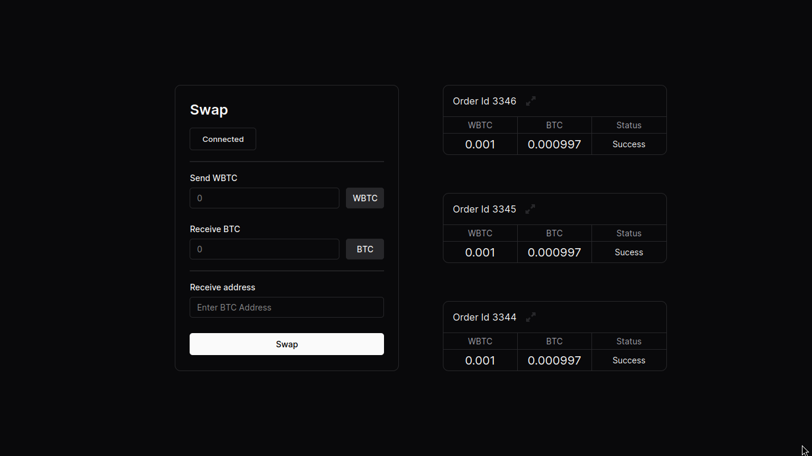
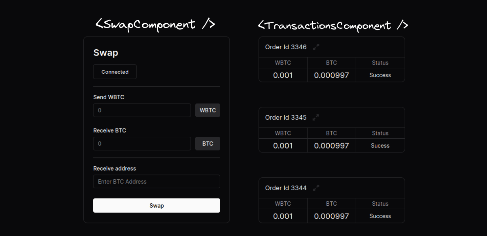
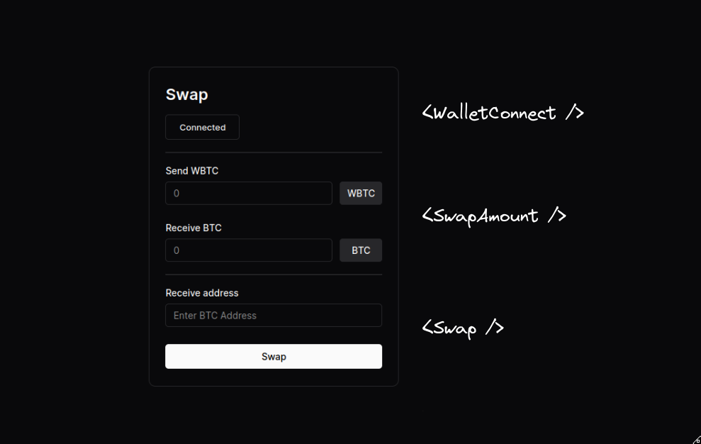
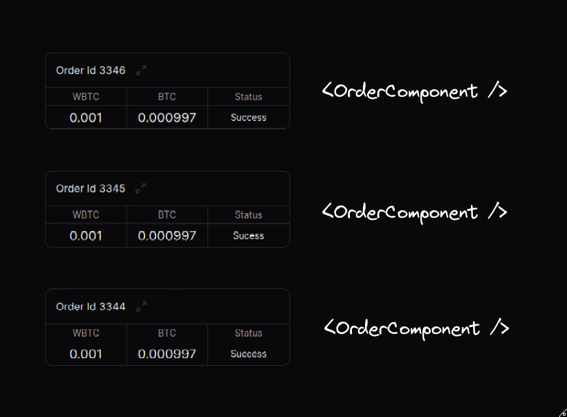

# Swapper Frontend

:::note
This guide is meant to be followed along side [Swapper Frontend](https://github.com/gardenfi/swapper-frontend) and is not meant for production use; it is merely an example to help you get started with the SDK.
:::

## Introduction
This guide details how to use the [Garden SDK](../developers/sdk/Sdk.md) to create a basic dApp that enables swapping WBTC to BTC. Visually, the UI would look something like the image below:



## Project Setup

Let's create a react app using the following command. If you don't have bun installed, please refer to [bun](https://bun.sh/).

```shell
# Creates a react-app using vite
bun create vite swapper --template react-ts
```

## Installing Dependencies
The following are the dependencies needed to build the dApp.

```shell
# Installs Garden SDK
bun add @catalogfi/wallets @gardenfi/orderbook @gardenfi/core ethers@6.8.0
```

## Installing dev dependencies
We need `vite-plugin-wasm` , `vite-plugin-node-polyfills`  and `vite-plugin-top-level-await` dependencies to work with the SDK in the frontend.

```shell
bun add -D \
  vite-plugin-wasm \
  vite-plugin-node-polyfills \
  vite-plugin-top-level-await
```

Let's update the vite config to the following.

```ts title="/vite.config.ts"
import { defineConfig } from "vite";
import react from "@vitejs/plugin-react";
import wasm from "vite-plugin-wasm";
import { nodePolyfills } from "vite-plugin-node-polyfills";
import topLevelAwait from "vite-plugin-top-level-await";

// https://vitejs.dev/config/
export default defineConfig({
  plugins: [react(), wasm(), nodePolyfills(), topLevelAwait()],
});
```

Now we are all set to build the dApp.

## The dApp

The documentation frequently discusses creating a `Garden`  instance and utilize it for swaps and other actions. Let's develop a hook to encapsulate the creation of the Garden instance. 
We'll use [Zustand](https://zustand-demo.pmnd.rs/) to manage the store in the Dapp since it requires minimal boilerplate and is user-friendly. If you're unfamiliar with it, please refer to [Zustand documentation](https://docs.pmnd.rs/zustand/getting-started/introduction) first.

### useGarden hook

```ts title="/src/store.tsx"
import { GardenJS } from "@gardenfi/core";
import { create } from "zustand";

type GardenStore = {
  garden: GardenJS | null;
  setGarden: (garden: GardenJS) => void;
};

const gardenStore = create<GardenStore>((set) => ({
  garden: null,
  setGarden: (garden: GardenJS) => {
    set(() => ({
      garden,
    }));
  },
}));

const useGarden = () => gardenStore((state) => state.garden);
```

`useGarden` is a simple hook that returns a Garden instance.

Next, let's create a hook that sets the Garden instance.

```ts title="/src/store.tsx"
// this hook has to be called at the root level only once
const useGardenSetup = () => {
// this could be useWeb3React too. (type of browserProvider from ethers)
  const evmProvider = useMetaMaskStore((state) => state.evmProvider);

  const setGarden = gardenStore((state) => state.setGarden);

  useEffect(() => {
    (async () => {
      if (!evmProvider) return;
      const signer = await evmProvider.getSigner();
      const bitcoinProvider = new BitcoinProvider(BitcoinNetwork.Testnet);

      const orderbook = await Orderbook.init({
        url: "https://stg-test-orderbook.onrender.com/",
        signer: signer,
        opts: {
          domain: (window as any).location.host,
          store: localStorage,
        },
      });

      const wallets = {
        [Chains.bitcoin_testnet]: new BitcoinOTA(bitcoinProvider, signer),
        [Chains.ethereum_sepolia]: new EVMWallet(signer),
      };

      const garden = new GardenJS(orderbook, wallets);

      setGarden(garden);
    })();
  }, [evmProvider]);
```
`useGardenSetup` will set the Garden provider whenever the EVM provider changes. 

For creation of wallets you can refer to [Creating Wallets](../developers/sdk/sdk-guides/CreatingWallets.md).

## Root component

```ts title="/src/App.tsx"
import SwapComponent from "./SwapComponent";
import TransactionsComponent from "./TransactionComponent";
import { useGardenSetup } from "./store";
import "./App.css";

function App() {
  useGardenSetup();
  return (
    <div id="container">
      <SwapComponent></SwapComponent>
      <TransactionsComponent></TransactionsComponent>
    </div>
  );
}

export default App;
```

We haven't employed Tailwind CSS or any other CSS library, and discussing CSS specifics for the app is outside the scope of this guide. However, you can find all the CSS code on GitHub [here](https://github.com/gardenfi/swapper-frontend/blob/main/src/App.css).

In this setup, `SwapComponent` includes the code for the swap screen, while `TransactionsComponent` contains the code for fetching the latest transactions of the currently active EVM account. Additionally, `TransactionsComponent` calls the `useGardenSetup` hook, which establishes the Garden instance.



## SwapComponent

```ts title="/src/SwapComponent.tsx"
import { useState } from "react";

const SwapComponent: React.FC = () => {
  const [amount, setAmount] = useState<AmountState>({
    btcAmount: null,
    wbtcAmount: null,
  });

  const changeAmount = (of: "WBTC" | "BTC", value: string) => {
    if (of === "WBTC") {
      handleWBTCChange(value);
    }
  };

  const handleWBTCChange = (value: string) => {
    let newAmount: AmountState = { wbtcAmount: value, btcAmount: null };
    if (Number(value) > 0) {
      const btcAmount = (1 - 0.3 / 100) * Number(value);
      newAmount.btcAmount = btcAmount.toString();
    }
    setAmount(newAmount);
  };

  return (
    <div className="swap-component">
      <WalletConnect />
      <hr></hr>
      <SwapAmount amount={amount} changeAmount={changeAmount} />
      <hr></hr>
      <Swap amount={amount} changeAmount={changeAmount} />
    </div>
  );
};
```

`WalletConnect`  manages the logic for connecting to MetaMask. `SwapAmount`  handles the logic for inputting amounts. `Swap`  manages addresses and the actual swapping process. Let's examine this component.

```ts title="/src/SwapComponent.tsx"
import { Assets } from "@gardenfi/orderbook";

type SwapProps = {
  amount: AmountState;
  changeAmount: (of: "WBTC" | "BTC", value: string) => void;
};

const Swap: React.FC<SwapProps> = ({ amount, changeAmount }) => {
  const garden = useGarden();
  const [btcAddress, setBtcAddress] = useState<string>();
  const { metaMaskIsConnected } = useMetaMaskStore();
  const { wbtcAmount, btcAmount } = amount;

  const handleSwap = async () => {
    if (
      !garden ||
      typeof Number(wbtcAmount) !== "number" ||
      typeof Number(btcAmount) !== "number"
    )
      return;

    // convert to least denominations
    const sendAmount = Number(wbtcAmount) * 1e8;
    const receiveAmount = Number(btcAmount) * 1e8;

    setBtcAddress("");
    changeAmount("WBTC", "");

    await garden.swap(
      Assets.ethereum_sepolia.WBTC,
      Assets.bitcoin_testnet.BTC,
      sendAmount,
      receiveAmount
    );
  };

  return (
    <div className="swap-component-bottom-section">
      <div>
        <label htmlFor="receive-address">Receive address</label>
        <div className="input-component">
          <input
            id="receive-address"
            placeholder="Enter BTC Address"
            value={btcAddress ? btcAddress : ""}
            onChange={(e) => setBtcAddress(e.target.value)}
          />
        </div>
      </div>
      <button
        className={`button-${metaMaskIsConnected ? "white" : "black"}`}
        onClick={handleSwap}
        disabled={!metaMaskIsConnected}
      >
        Swap
      </button>
    </div>
  );
};
```

The main logic we want to focus on is `handleSwap`. `garden.swap` facilitates the swap process by creating the swap using the specified assets and amounts. It's as straightforward as that.



## Transactions Component

We will not discuss the whole component here, but let's look at how we fetch the orders, aka transactions.

```ts title="/src/TransactionsComponent.tsx"
import {
  Actions,
  Order as OrderbookOrder,
} from "@gardenfi/orderbook";

function TransactionsComponent() {
  const garden = useGarden();
  const { evmProvider } = useMetaMaskStore();
  const [orders, setOrders] = useState(new Map<number, OrderbookOrder>());

  useEffect(() => {
    const fetchOrders = async () => {
      if (!garden || !evmProvider) return;

      const signer = await evmProvider.getSigner();
      const evmAddress = await signer.getAddress();

      if (!evmAddress) return;

      garden.subscribeOrders(evmAddress, (updatedOrders) => {
        setOrders((prevOrders) => {
          const updatedOrdersMap = new Map(prevOrders);
          updatedOrders.forEach((order) =>
            updatedOrdersMap.set(order.ID, order)
          );
          return updatedOrdersMap;
        });
      });
    };

    fetchOrders();
  }, [garden, evmProvider]);

  const recentOrders = Array.from(orders.values())
    .sort((a, b) => b.ID - a.ID)
    .slice(0, 3);

  if (!recentOrders.length) return null;

  return (
    <div className="transaction-component">
      {recentOrders.map((order) => (
        <OrderComponent order={order} key={order.ID} />
      ))}
    </div>
  );
}
```



`garden.subscribeOrders` will create a socket connection with the orderbook backend, fetches all orders on the first request and updated-orders on subsequent requests. Now performing actions on orders is as follows.

```ts
const swapper = garden.getSwap(order);
const performedAction = await swapper.next();
```

`swapper.next()` performs required actions to go into next state. If you created an order, `.next()` will initiate the order by depositing funds. Once the counterparty initiates, calling `.next` redeems the funds on destination chain. But when to do what? To do so, you can parse the order status using the code snippet below.

```ts
import {
  Actions,
  parseStatus,
} from "@gardenfi/orderbook";

const parsedStatus = parseStatus(order);
// parsedStatus could be one of these (UserCanInitiate, UserCanRedeem, UserCanRefund etc.)
```

Checkout full code [here](https://github.com/gardenfi/swapper-frontend).
