# How to swap BTC to WBTC
1. Go to garden.finance and click on the Swap tab, then click the “Connect” button in the top right corner.
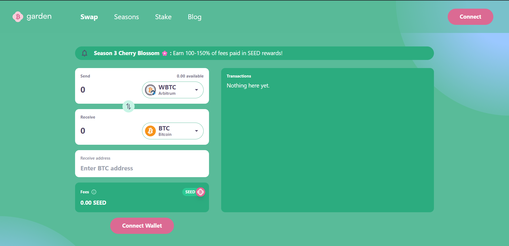

2. Click on MetaMask and confirm the account you want to use to perform the swap.
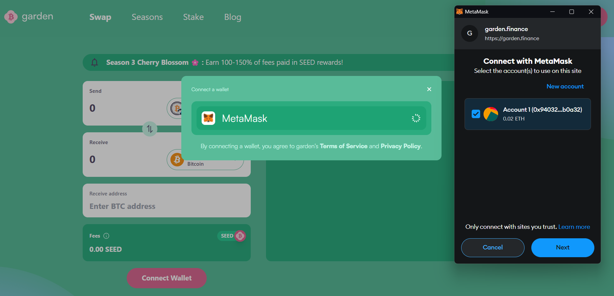

3. Read the sign-in message and confirm sign-in. 
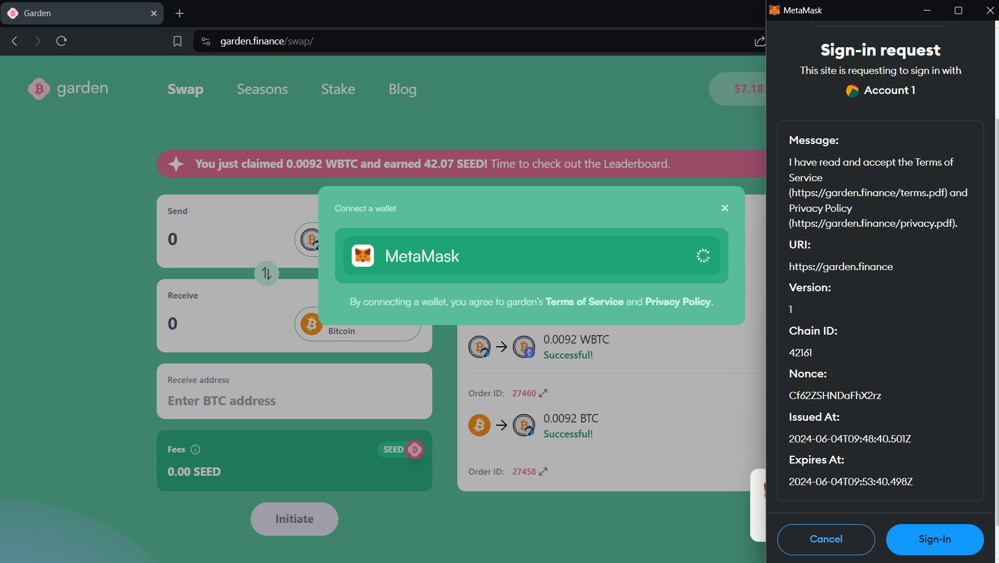

4. Select the Bitcoin chain for sending BTC.
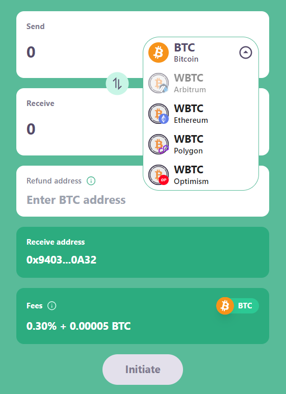

5. Choose the blockchain network where you want to receive WBTC.
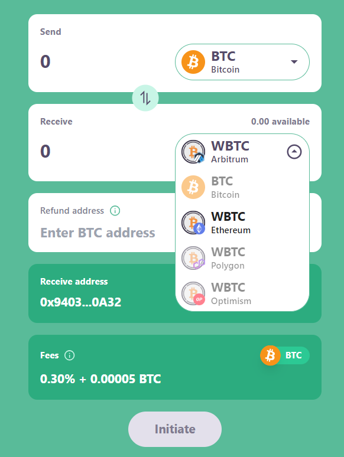

6. Copy and paste your BTC address into the "Refund Address" field. This address will be used to return your BTC in case the transaction fails. 
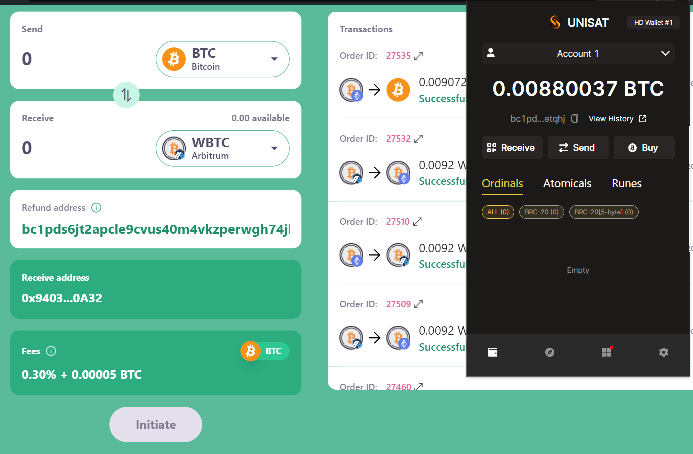

7. Enter the amount of BTC you wish to swap, then click "Initiate."
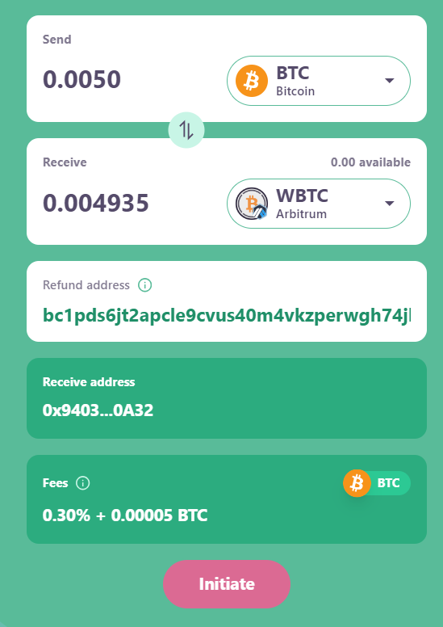

8. Sign the transaction initiation request in your wallet by clicking "Sign" on the Signature Request 
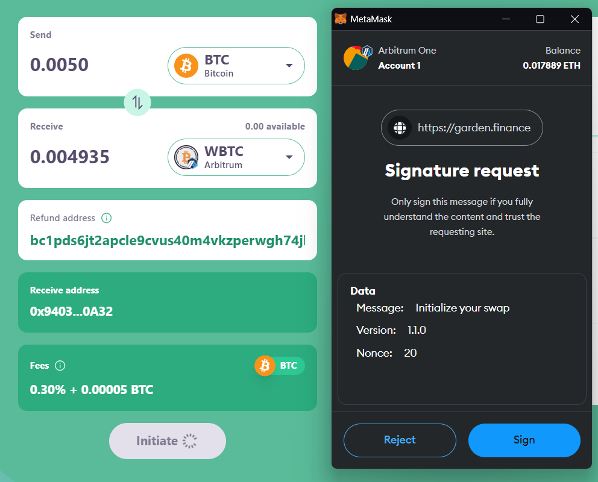

9. From the Transactions tab, Copy the HTLC contract address (changes for each transaction) where you need to send the BTC for order fillers to pick up the order.
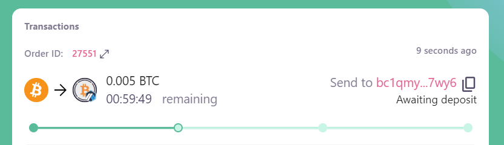

10. Send the BTC amount specified in step 7 to the deposit address you copied in previous step. 
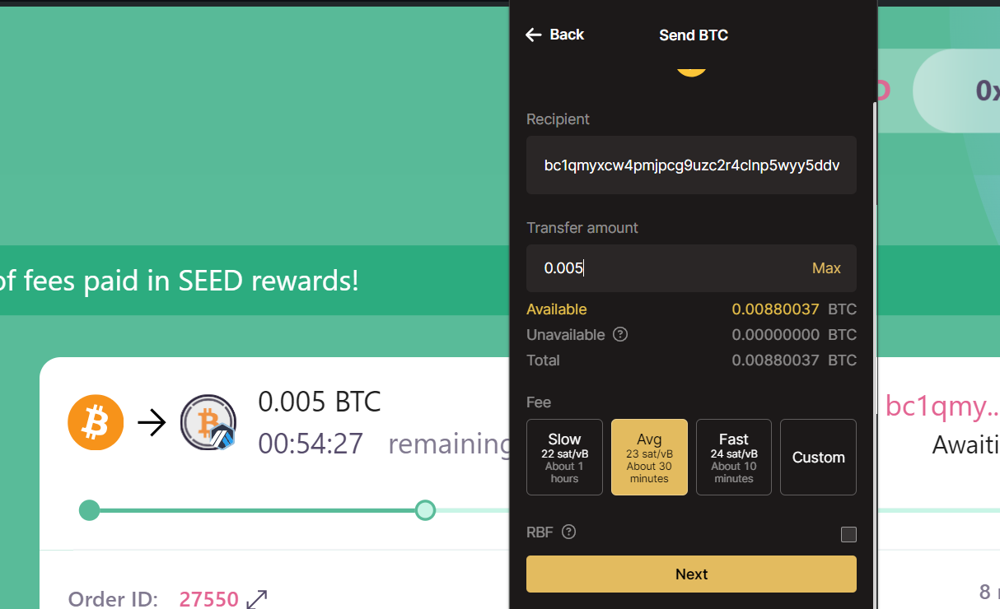

11. Wait for order fillers to pick up the order and deposit the required WBTC, along with its on-chain confirmation. Then, claim your WBTC by clicking on "Claim WBTC." 
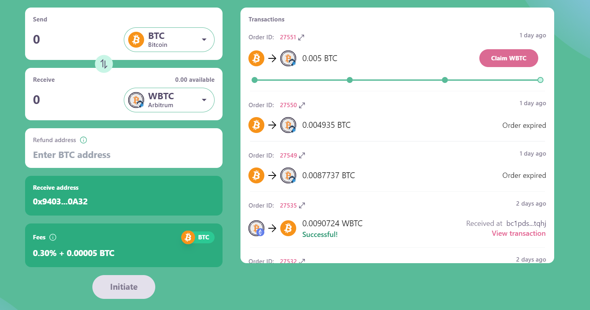

12. "Sign" the Signature Request for the claim transaction and "Confirm" in the message pop-up.
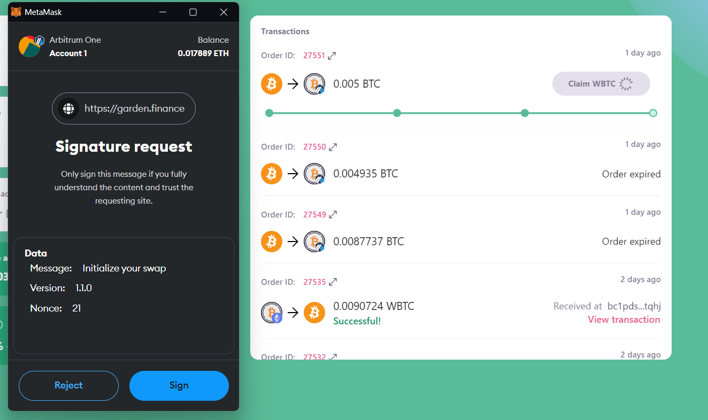

Congratulations! Your swap is complete. You can check your order details by clicking on "Order ID."

