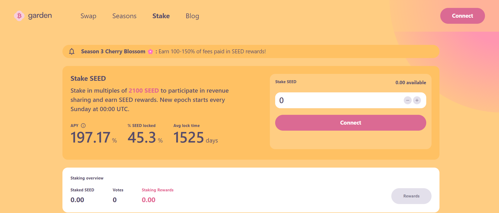
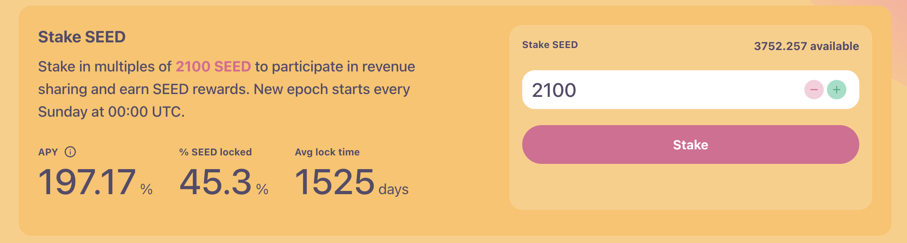
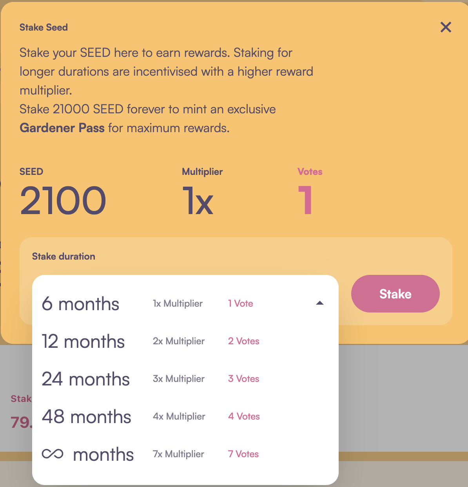
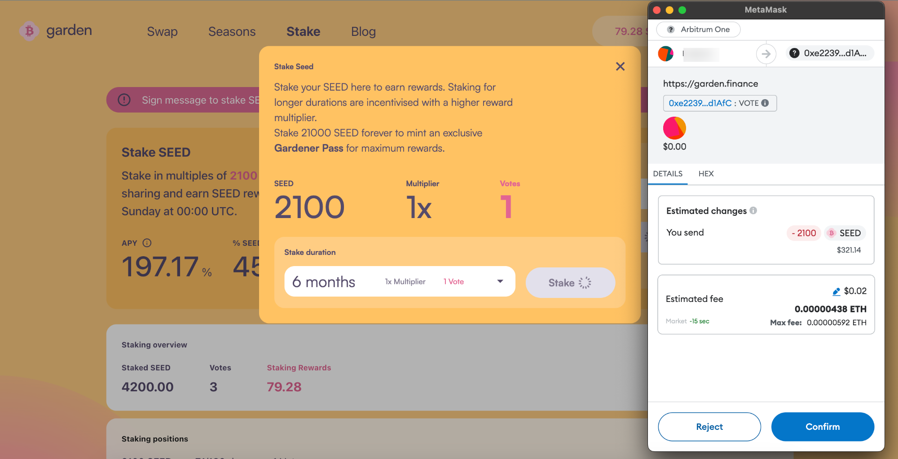

# How to stake $SEED
1. Visit the Stake Page: Navigate to https://garden.finance/stake/ and connect your wallet to the platform.

2. Input Stake Amount: Enter the desired amount of SEED tokens you wish to stake, ensuring it meets the minimum requirement of 2100, then click "Stake.

3. Choose Stake Duration:  Select your preferred stake duration, ensuring it meets the minimum requirement of 6 months.

4. Confirm Stake Transaction: Click "Stake" and proceed to confirm the transaction within your connected wallet.

5. Verify Staking Position: After confirmation, your staking position will be displayed in the "Staking Positions" section of the platform.

Congratulations! You have successfully staked your SEED. 