# How to swap WBTC to BTC
1. Go to garden.finance and click on the Swap tab, then click the “Connect” button in the top right corner.
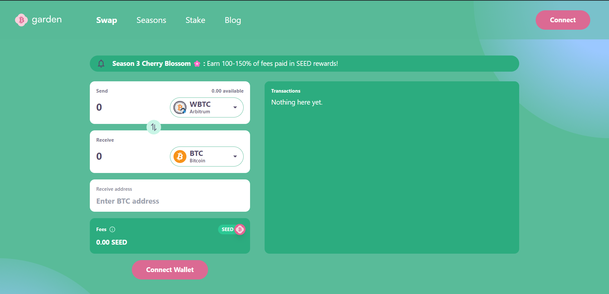

2. Click on MetaMask and confirm the account you want to use to perform the swap.
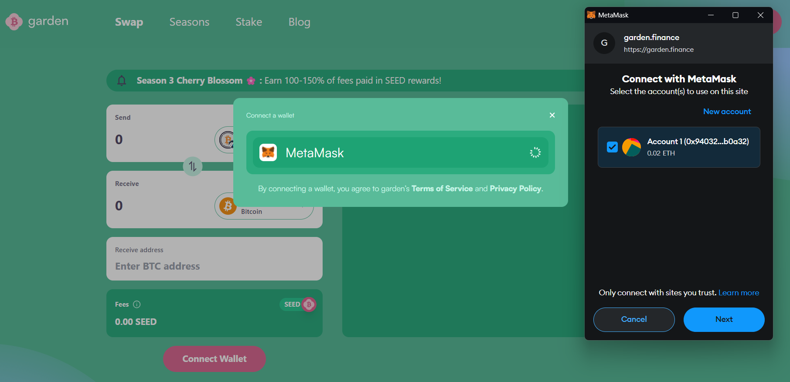

3. Read the sign-in message and confirm sign-in. 
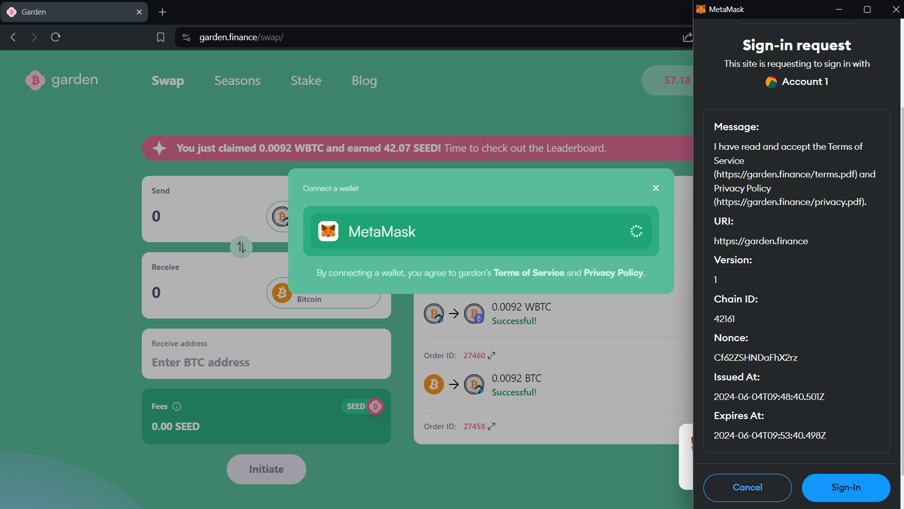

4. Select the blockchain network from which you want to send WBTC.
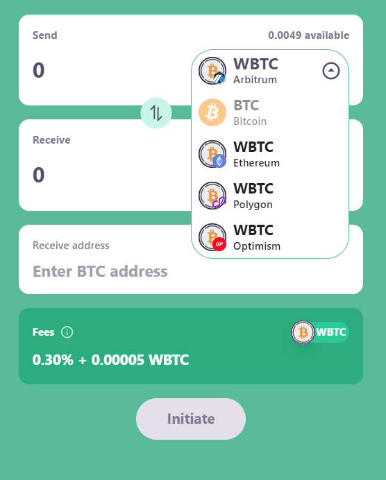

5. Select the Bitcoin blockchain network to receive BTC.
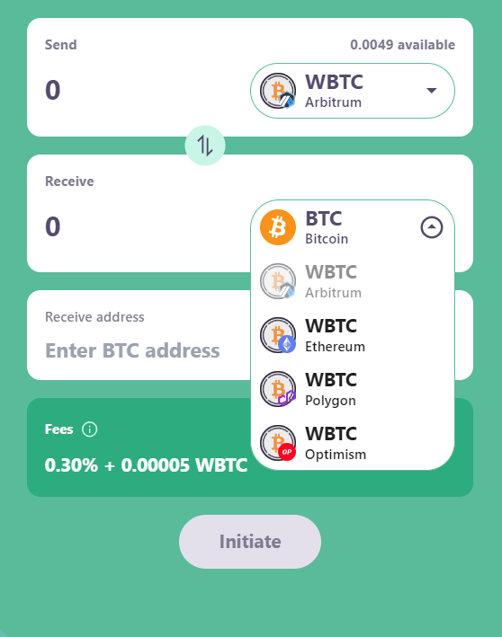

6. Copy your Bitcoin address and paste it into the "Receive Address" field.
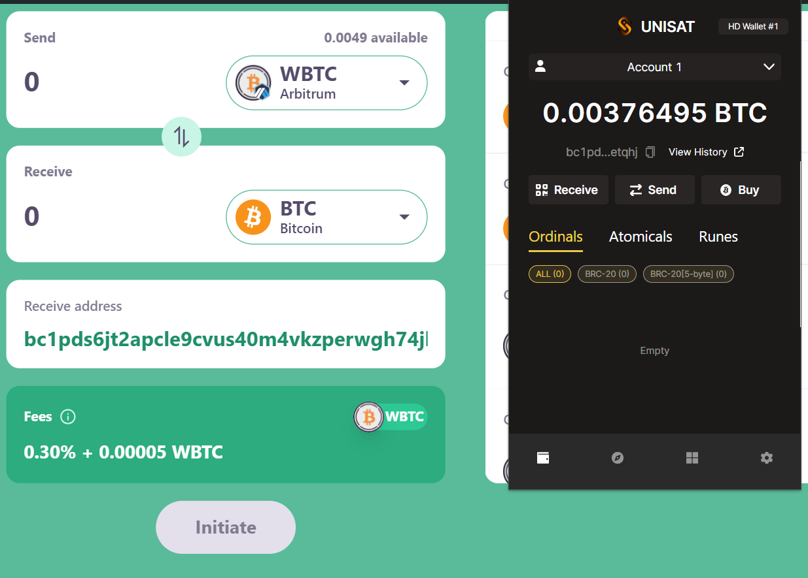

7. Enter the amount of WBTC you wish to swap, then click "Initiate."
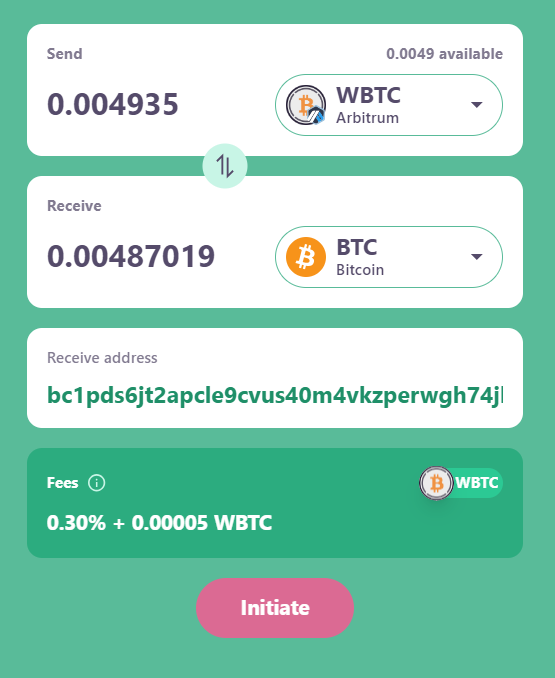

8. Click "Sign" on the Signature Request to initiate the swap.
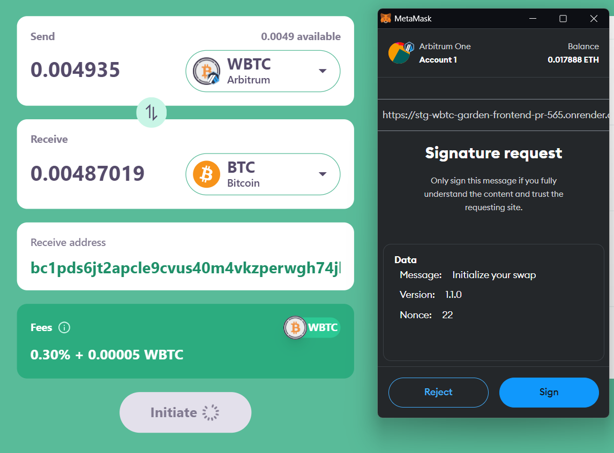

9. Click on "Deposit WBTC" on the transactions tab.
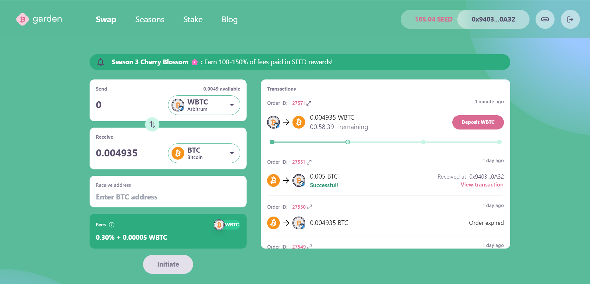

10. Enter the amount of WBTC you chose to swap in step 7 and confirm the transaction by signing it in the wallet.
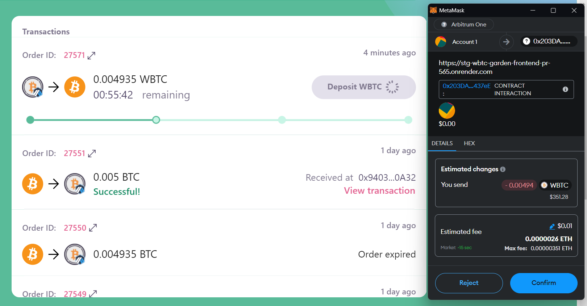

11. Wait for order fillers to pick up the order and deposit your required BTC into an HTLC contract and its on-chain confirmation. Then, claim your BTC and click "Claim WBTC."
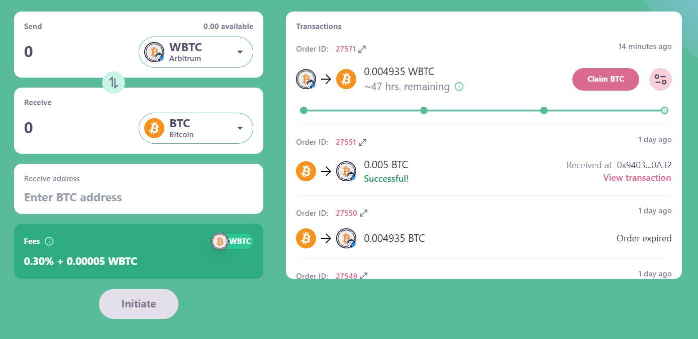

12. Sign the claim BTC signature request.
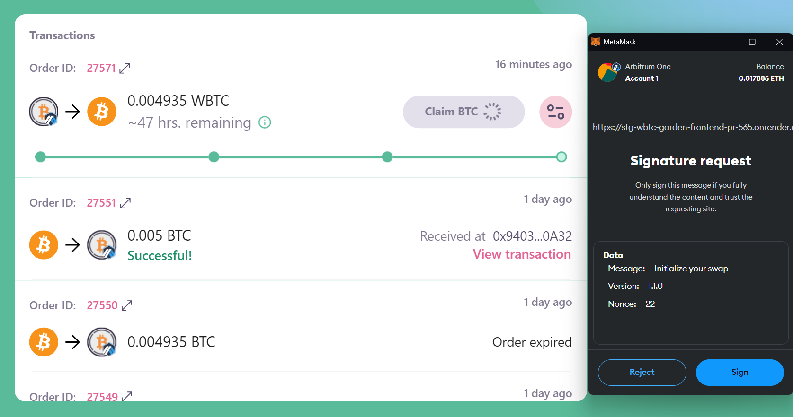

Congratulations! Your swap is done. You can check your order details by clicking on "Order ID."