# How to swap WBTC to WBTC
1. Go to garden.finance and click on the Swap tab, then click the “Connect” button in the top right corner.
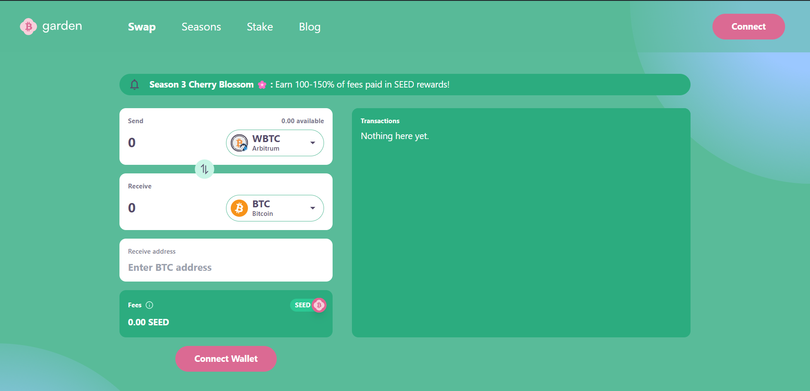

2. Click on MetaMask and confirm the account you want to use to perform the swap.
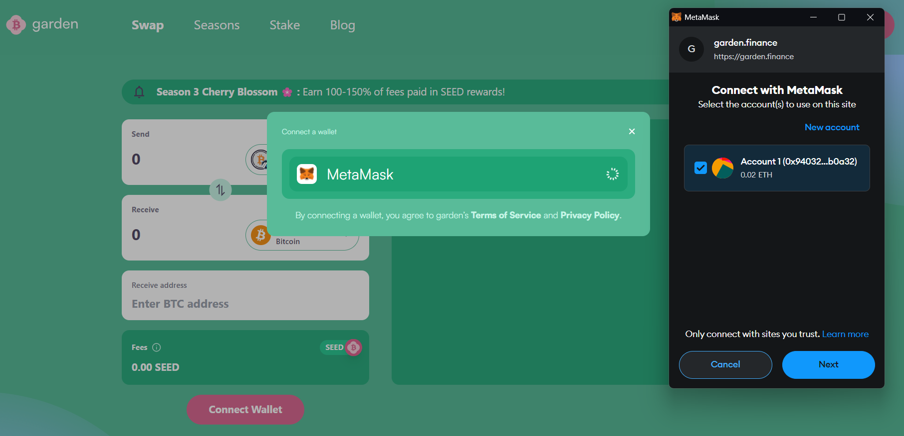

3. Read the sign-in message and confirm. 
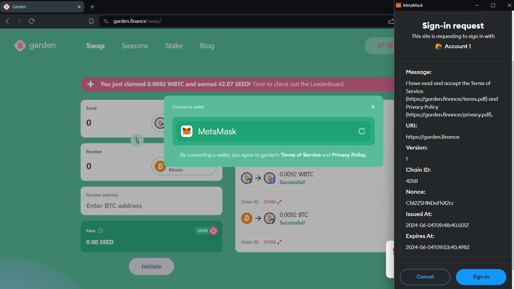

4. Select the desired chain for sending WBTC
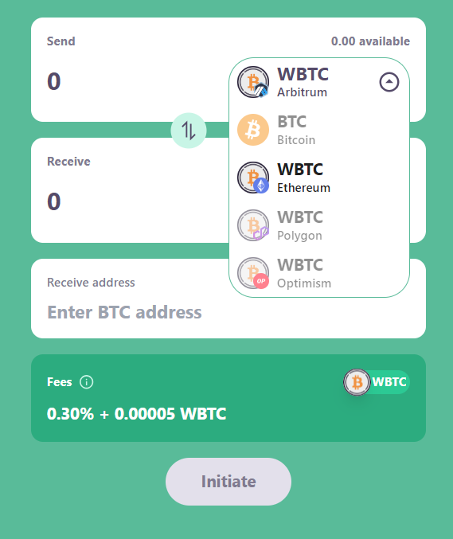

5. Select the desired chain for receiving WBTC
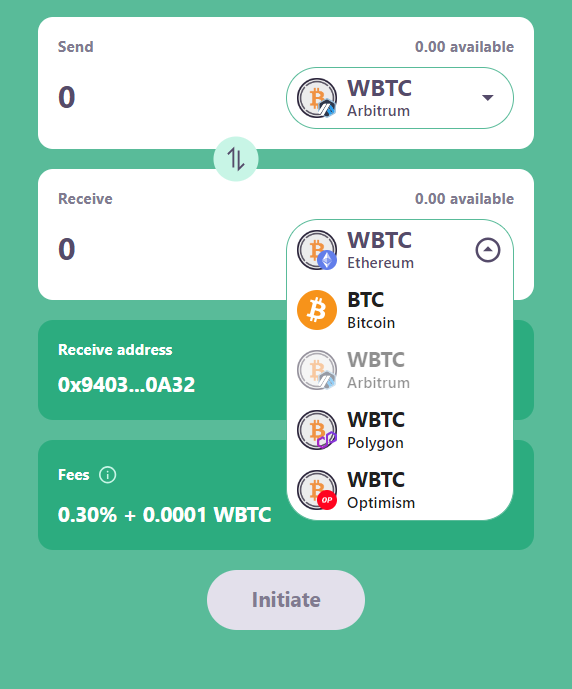

6. Enter the amount of WBTC you want to swap and Click “Initiate”
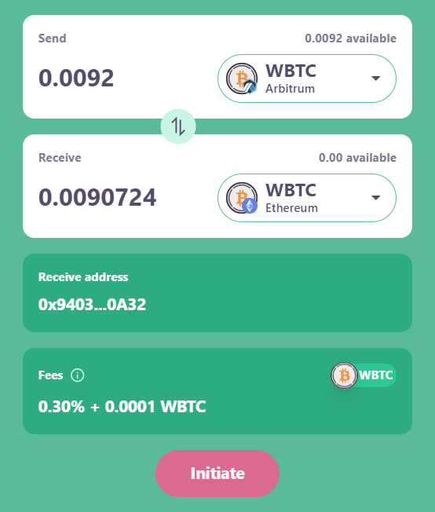

7. Click “Sign” on the order initiation request  
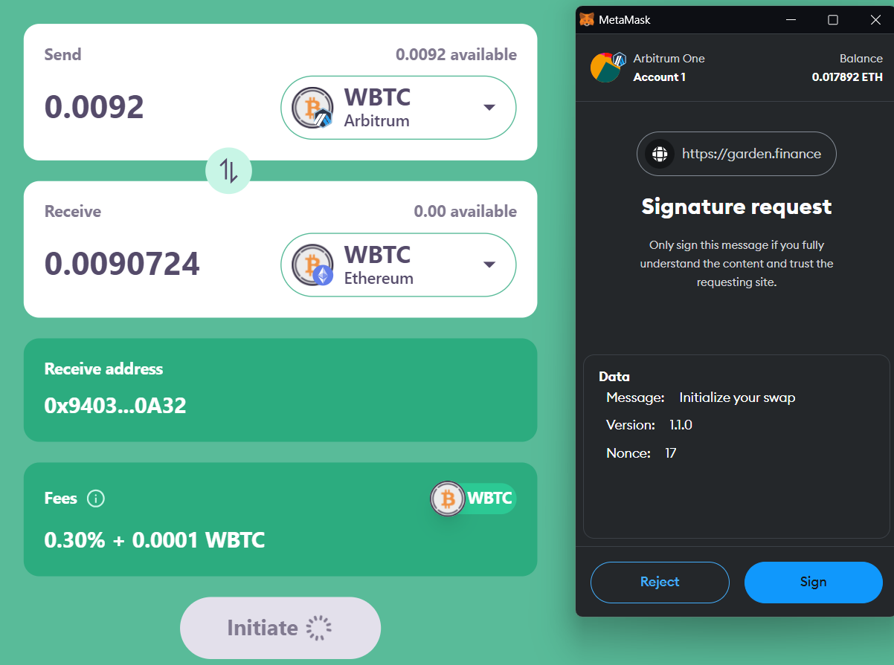

8. Click on “Deposit WBTC” in transactions tab and confirm 
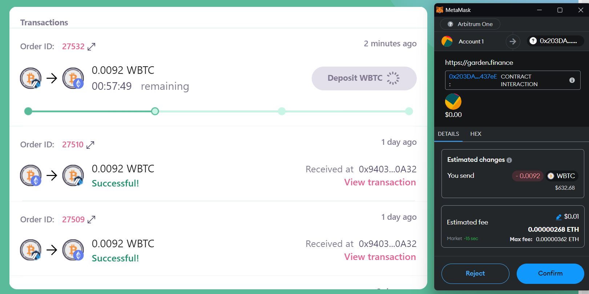

9. Wait for order fillers to accept your order, which is an on-chain confirmation. Then Claim your WBTC.

90. Click “Claim WBTC” and confirm ”Switch Network,” which changes the wallet chain to the receiving chain.
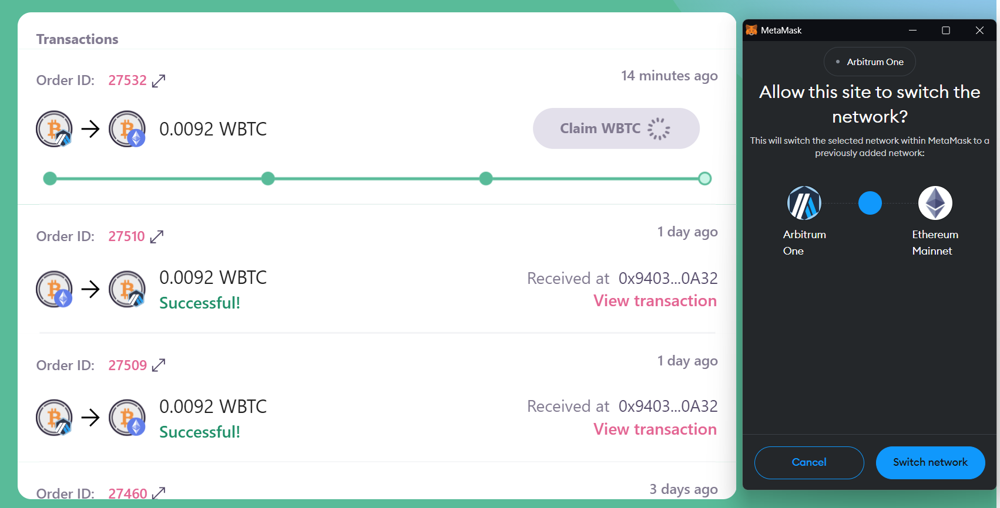
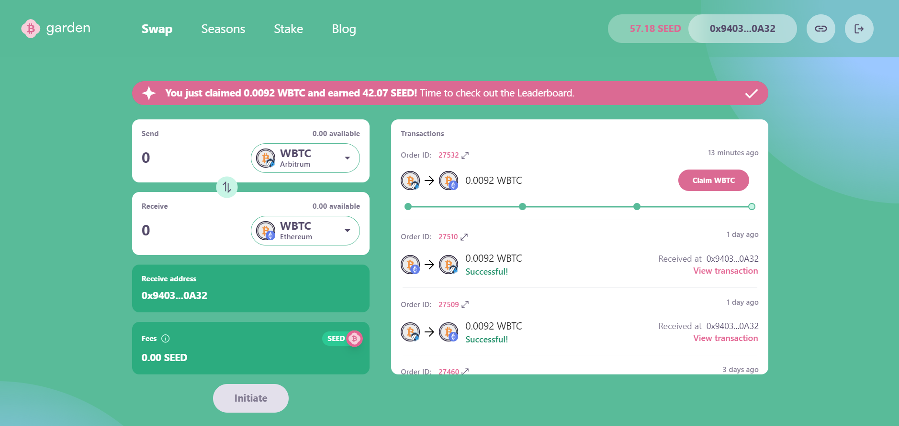

11. Click on "Claim BTC" on the desitnation chain. 
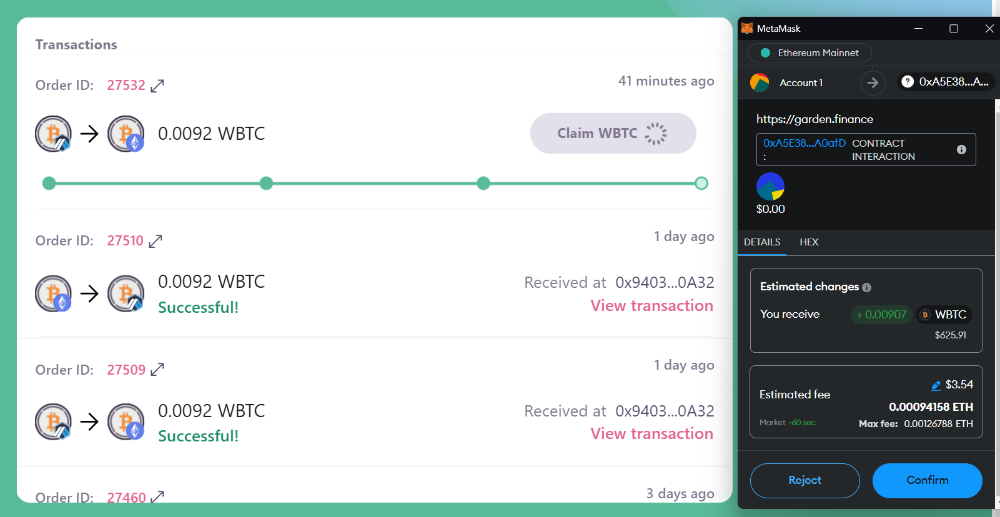

Congratulations! Your swap is done; you can check your order details by clicking on “Order ID”
