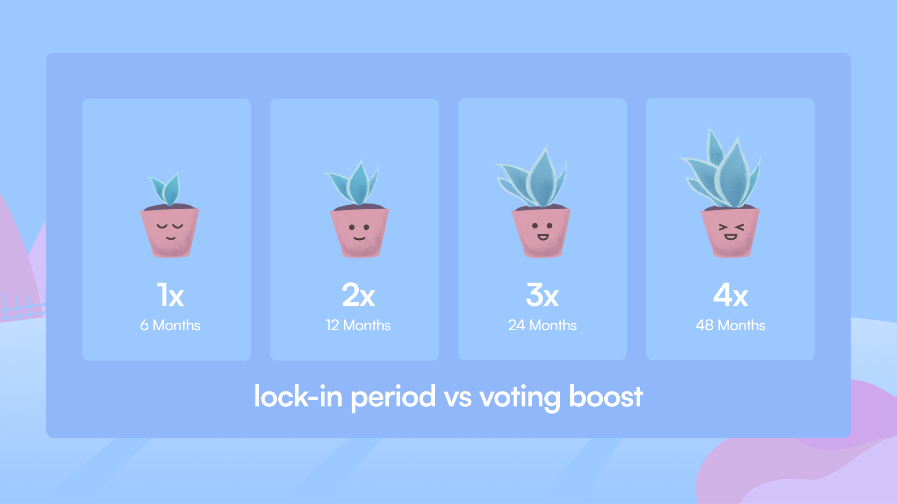

# Stake
Stakers are vital in maintaining the system's integrity by overseeing order Fillers and ensuring their ethical and efficient operation. They have the authority to reward diligent Fillers with additional orders, thus preventing any single filler from completely dominating the system. This balanced approach creates a healthy and competitive environment where fillers are encouraged to excel while maintaining fairness and transparency.
### Who Can Stake SEED?
Anyone holding a minimum of 2,100 SEED tokens on the Arbitrum chain is eligible to stake. To do so, visit the [Stake](https://garden.finance/stake/) page on the website. 

If you are holding SEED on a chain other than Arbitrum, you can use the [official Arbitrum bridge](https://bridge.arbitrum.io/?amount=1&destinationChain=arbitrum-one&sourceChain=ethereum&ref=wbtc) to transfer your SEED to Arbitrum for staking.

The staking APY varies based on the number of Garden users staking and the duration of their stakes. A dynamic APY ticker on Garden’s staking page lets users stay updated with the current APY.

### Staking Multiplier 
The long-term commitment of stakers is incentivized by boosting their voting/earning capability. Staking for 6 months gets 1 vote for that period, while staking for 4 years means 4 votes for the entire duration, resulting in 4x the APY compared to someone staking for 6 months. Below is the visual representation of the multiplier stakers can enjoy: 

