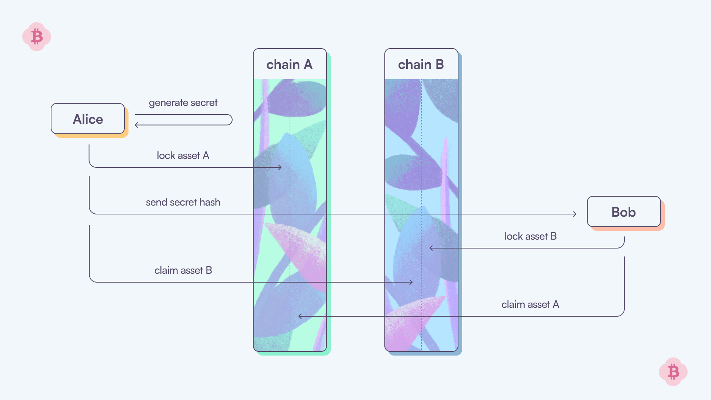

# Atomic Swaps

Hashed Time Locked Contracts (HTLCs) are a type of smart contract used in blockchain transactions to enforce a time-bound condition for transferring assets between parties. They require the receiver of a transaction to acknowledge receiving the payment by generating a cryptographic proof within a certain timeframe. This proof is a response to a cryptographic challenge embedded in the contract, typically involving a hash function. If the receiver fails to provide the correct proof within the specified time, the transaction is automatically reversed, returning the assets to the sender. HTLCs are crucial for enabling trustless and secure atomic swaps between different cryptocurrencies.

Here's a simple representation to understand the key components and flow of a Hashed Time-Locked Contract (HTLC) in the garden:

**A simple example**: Alice wants to swap asset A with Bob’s asset B. Here’s how the process unfolds:
1. Alice deposits asset A into a transparent vault on chain A.
2. Bob checks the deposited amount and, if it matches the expected amount, deposits asset B into an identical transparent vault on chain B.
3. Alice verifies the amount deposited by Bob and, if correct, opens the vault to collect asset B.
4. Bob can now collect asset B from Alice’s vault; the swap is complete.

To address scenarios where Alice deposits the wrong amount, or Bob decides not to proceed with the swap after Alice’s deposit, certain precautions are in place:
- Alice sets up her vault so that if it remains unopened for a specified period of time (usually 48 hours), she can reclaim her funds.
- Bob, in case he suspects the wrong amount was deposited or Alice refuses to open his vault, has a window of *x*/2 time (usually 24 hours) to retrieve his funds.

By staggering the expiration times of the vaults, with Bob’s vault expiring earlier than Alice’s, Bob has ample time to retrieve his funds before Alice can do so. This simple yet secure system enables Alice and Bob to trade assets without trust.

