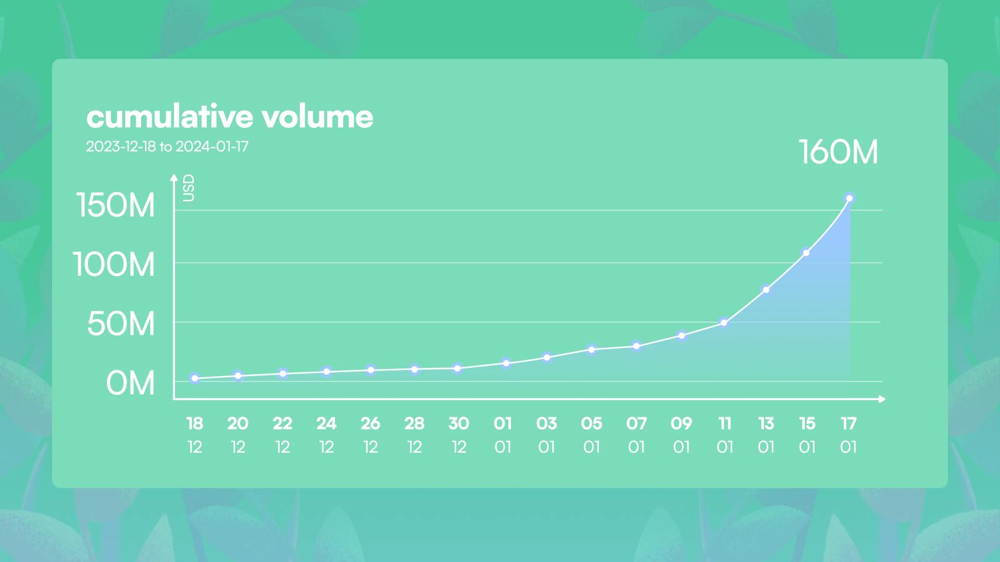
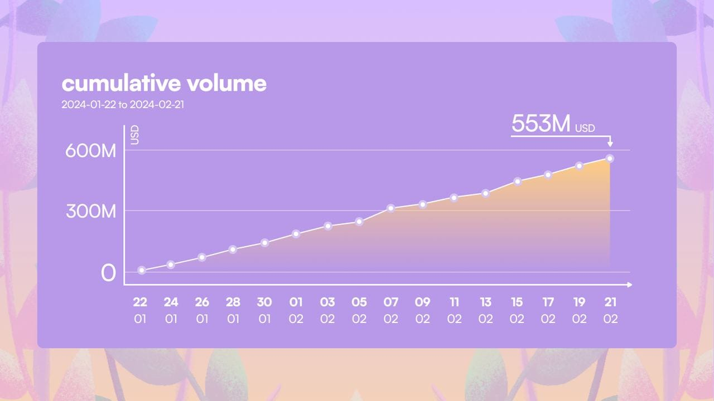

# Seasons
Seasons are a main component of Garden's incentive program, designed to boost community engagement and enhance user experience through structured trading periods. Each season runs for a specific timeframe and offers unique challenges and SEED rewards to encourage active participation on the Garden platform.

## Season 1 Recap
Season 1 of Garden concluded with significant achievements that surpassed our expectations. As the season ended with the symbolic melting of our Snowman, we observed a remarkable increase in daily trading volumes, achieving a peak of 615 BTC on the final day.

Total swap volume generated in Season 1: 

You can read more about Season 1 [here](https://garden.finance/blogs/season-1-review/). 
## Season 2 Recap 
Season 2 at Garden concluded with impressive achievements, highlighted by a 300% increase in total trading volume, reaching approximately $553 million by the end of the season. This remarkable growth was also reflected in our daily average volume, which more than tripled compared to Season 1, showcasing an action-packed period filled with significant advancements and community engagement.

Total swap volume generated in Season 2: 

You can read more about Season 2 [here](https://garden.finance/blogs/season-2-review/). 
## Season 3 Ongoing 
Season 3 of Garden, dubbed Cherry Blossom 🌸, is now underway, focusing on real-world usage of the Bitcoin DeFi ecosystem via the Arbitrum network. Launched on May 13th, this season continues until all 5 million SEED allocated to the reward pool are distributed—a significant portion, representing about 3.4% of the total SEED supply. This allocation follows the 10 million SEED already distributed in previous seasons, with this season introducing direct token rewards for activities like swaps between BTC-WBTC and WBTC-WBTC. Participants can earn 100-150% of swap fees back plus SEED bonuses, with a chance at random multipliers, enhancing the potential rewards significantly.

You can read more about Season 3 [here](https://garden.finance/blogs/season-3-cherry-blossom/).
