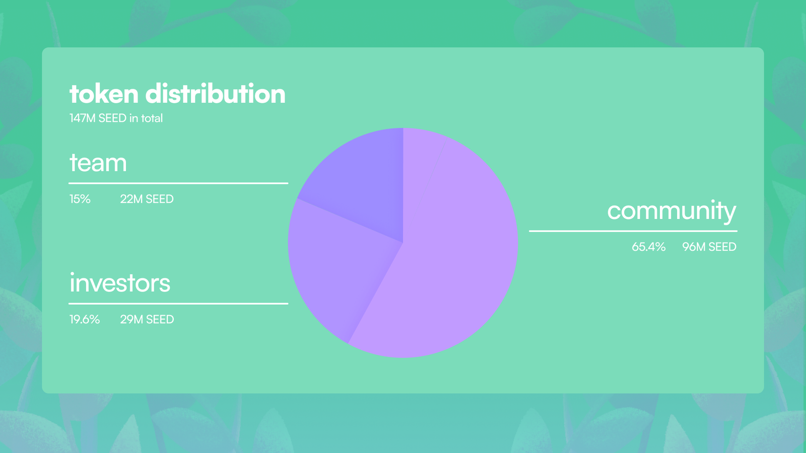

# Introduction to SEED 
SEED is the fundamental utility token at the heart of Garden, designed to fuel the platform's ecosystem and empower our community. Launched on January 18th, 2024, SEED facilitates community engagement, incentivizes participation, and enhances interactions within the protocol.
## Token Utility and Benefits
- **Staking**: Stake SEED tokens to participate in decision-making and earn a yield through our revenue-sharing model. A minimum of 2,100 SEED are required to stake. 
- **Market Making**: Holding 210,000 SEED tokens grants eligibility to participate in our market-making activities and become an order Filler.
- **Discounted Trading Fees**: Pay trading fees with SEED tokens to enjoy reduced rates, making your transactions more efficient and cost-effective.
- **Exclusive Access**: SEED holders gain early access to new features and exclusive contests, enhancing their engagement and experience within Garden.

## Tokenomics and Allocation
- **Total Supply**: 147,000,000 SEED
- **Community Incentives**: 54.4% (80,000,000 SEED) allocated for community growth and engagement through various programs.
- **Liquidity and Partnerships**: 5.5% (8,000,000 SEED) to support liquidity and establish strategic partnerships.
- **Grants**: 5.5% (8,000,000 SEED) reserved for both tech and non-tech community grants.
- **Team**: 15% (22,000,000 SEED) earmarked for the Garden team, with a lock-in period coinciding with the duration of the seasons program.
- **Investors**: 19.6% (29,000,000 SEED) allocated to early backers, with tokens locked until the end of the seasons program.

## SEED Emission Schedule
- **Seasons Program**: The primary avenue for earning SEED. Tokens are distributed based on participation and achievements within each [season](./Seasons.md).
- **Emission Decay**: Token rewards will decay by 25% every four seasons, ensuring a sustainable emission rate and incentivizing early participation.
  - Seasons 1-4: Each season allocates 5,000,000 SEED (~3.4% of total supply).
  - Seasons 5-8: Each season allocates 3,750,000 SEED (~2.6% of total supply).
  - Seasons 9-12: Each season allocates 2,810,000 SEED (~2% of total supply).

## Future Outlook 
The SEED allocation for community incentives may be revised based on proposals from the gardener community, ensuring that our tokenomics remain dynamic and responsive to our users' needs.

