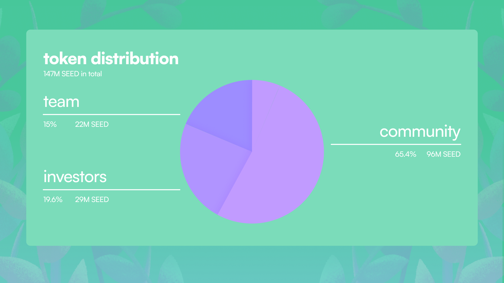
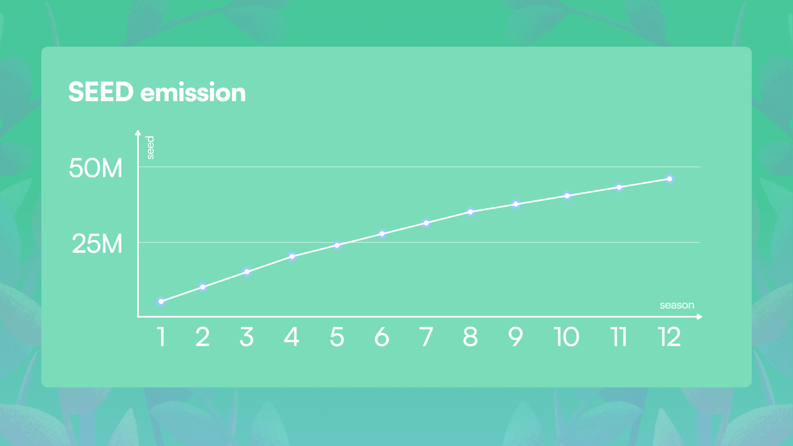

# Tokenomics

*TL;DR SEED forms the core of Garden's tokenomics. The token went live at the close of Season 1 (January 18th). Earn SEED tokens by actively engaging in our [Seasons program](https://garden.finance/leaderboard/?ref=wbtc-garden.ghost.io)! Stake SEED to earn APY through our revenue-sharing initiative. Find us on [𝕏](https://twitter.com/wbtcgarden?ref=wbtc-garden.ghost.io) to grab access codes for the app.*

**Ethos of SEED**

As web3 natives ourselves, we've witnessed various token behaviors, both good and bad, over the years. This understanding drives our tokenomics ethos:

- Encouraging long-term community participation without deterring future users.
- Promoting trading activity within the app.
- Strengthening the web3 ecosystem.
- Collaborating and growing with other web3 projects and communities.

**SEED in Numbers**

SEED will have a total supply of  147,000,000 tokens. All of which will be minted during TGE on 18th January 2024 (i.e. end of Season 1). Token allocations are as follows:

- 54.4% (80,000,000 SEED) for Garden community incentive programs.
- 5.5% (8,000,000 SEED) for liquidity incentives and partnerships.
- 5.5% (8,000,000 SEED) for tech and non-tech community grants.
- 15% (22,000,000 SEED) for team members.
- 19.6% (29,000,000 SEED) to investors.

We want Garden to be a community centric project, hence we have allocated 2/3rds of the token for community growth and nurturing. The team and investor tokens will be locked until the end of the seasons program.

**SEED Emission**

Our [Seasons program](https://garden.finance/leaderboard/?ref=wbtc-garden.ghost.io) is the only means to acquire new SEED tokens. Each season has a predetermined SEED token allocation, distributed among participating gardeners based on their points relative to others. Over 18-24 months, we'll host 12 seasons, not necessarily consecutive. Tokens rewarded decay by 25% every 4 seasons, distributing around 31% of the tokens to the community.

> ***The inaugural season, Snowman, is allocated 5,000,000 SEED tokens (~3.4%).***

Here's a clear breakdown of the token allocation for each season:

- Seasons 1-4: 5,000,000 SEED per season (~3.4%)
- Seasons 5-8: 3,750,000 SEED per season (~2.6%)
- Seasons 9-12: 2,810,000 SEED per season (~2%)

Following the seasons program, community incentives will refresh, informed by gardener community proposals.

**SEED Utility**

- Staking: Stake 210,000 SEED tokens to become eligible to participate in market making. Users can stake lots of 2,100 SEED against market makers of their choice through a delegated proof of stake (DPoS) model to earn a share of their revenue. [Last updated: Jan 16, 2024]
- Discounted Trading Fees: SEED tokens unlock the benefit of reduced trading fees within Garden. Use SEED as a payment method for trading fees and enjoy discounted rates, making transactions more cost-effective for active participants.
- Token Gated Incentives: SEED holders can have access to exclusive contests and early features.
